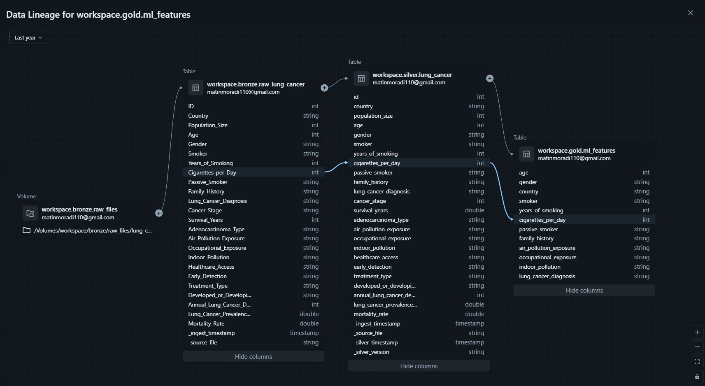
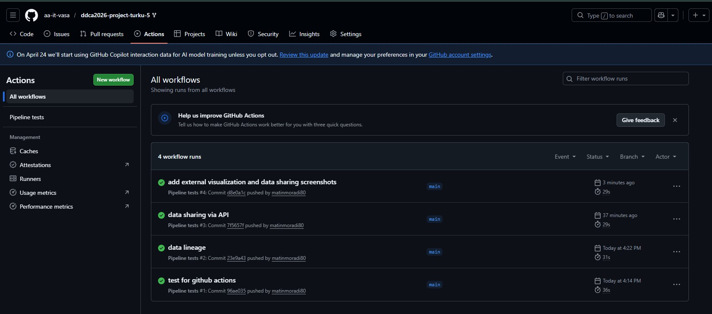
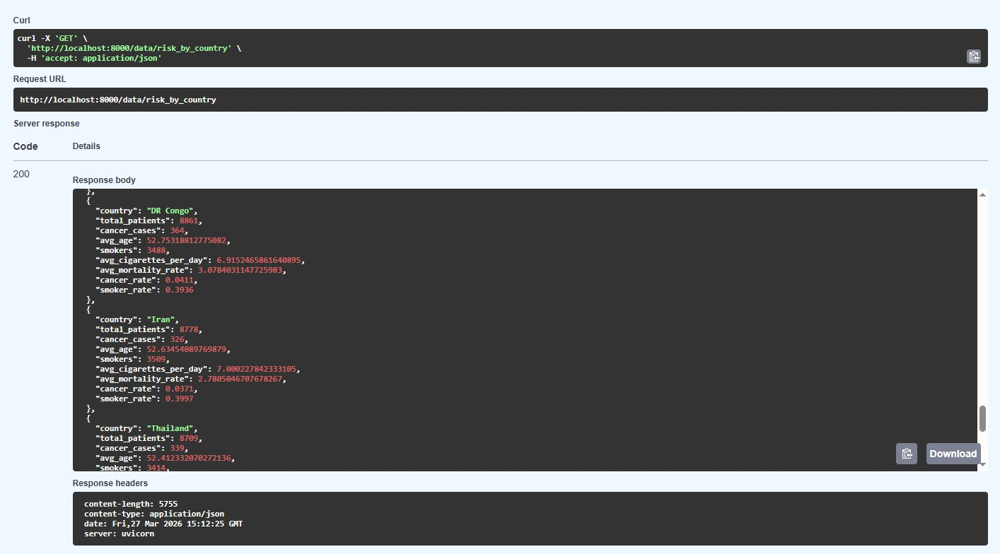
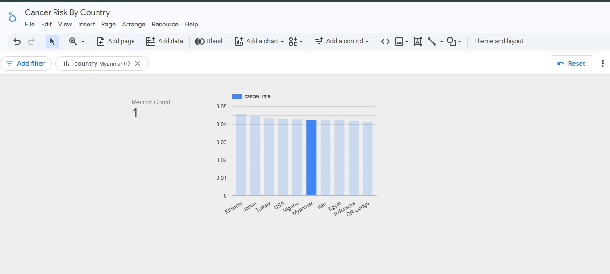

## Docs Directory

The Docs foler conatin the supporting documentation for our project. It includes screenshots, data lineage diagrams, and automated testing evidence.

---

#### `data_contract.json` - API data contract (JSON Schema)

Schema: JSON Schema Draft-07

Version: 1.0.0

This JSON file contains input/output contract for the lung cancer risk prediction API (`POST /predict`). The table below shows the input field, type, and contraints for request/response.  

| Field | Type | Constraints |
|---|---|---|
| age | integer | 0 - 120 |
| country | string | min length 2 |
| gender | string | "Male" or "Female" |
| smoker | string | "Yes" or "No" |
| years_of_smoking | integer | ≥ 0 |
| cigarettes_per_day | integer | ≥ 0 |

| Field | Type | Constraints |
|---|---|---|
| risk_score | number | 0.0 - 1.0 |
| risk_label | string | "Low", "Medium", or "High" |
| model_version | string | — |

### Screenshots & Diagrams

**data_lineage.jpg** - End-to-end data lineage diagram

The image shows the pipeline flow from raw files ingestion to gold-layer tables and the API. It demonstrates the medallion architecture (Bronze → Silver → Gold) along with external outputs such as FastAPI and Google Looker Studio. 

---

**Lung Cancer Risk prediction API.png** - FastAPI Swagger UI

Screenshot showing `POST /predict` - individual risk scoring.

---

**Job Schedule Air Quality.png** - Databricks job schedule

This image shows the Databricks workflow scheduler. It shows the automated run schedule when the air quality ingestion pipeline is executed. Our pipeline fetched real-time data from  Open-Meteo API. Later, the result is appended to `bronze.raw_air_quality`.

---

**automated_testing_github_actions.jpg** - CI pipeline (GitHub Actions)

Screenshot of the GitHub Actions workflow. It shows that the automated test suite (`test/test_pipeline.py`) passes on every push. The image validates our schema integrity and data quality constraints. 

---

**test_results.jpg** - Local test run results

This image shows the output of various pytest from local system. It includes the test cases, status, and time taken for execution. 

---

**data_sharing_via_api.jpg** - Live API data sharing

This screenshot shows the `GET /data/risk_by_country` endpoint getting the response from gold layer. 

---

**external_visualization_google_looker_studio.jpg** - Google Looker Studio dashboard

This screenshot shows the external Looker Studio dashboard connected to the `risk_by_country.csv` export. We can see the cancer rate, smoker rate, and average age, and other visualization across all 25 countries. 

---

### Relationship to Pipeline Layers

**data_contract.json   ------>  defines schema for  POST /predict**

**data_lineage.jpg            ------>  documents full Bronze → Silver → Gold flow**

**Job Schedule Air Quality    ------>  evidence of scheduled Open-Meteo ingestion**

**automated_testing_github_actions.jpg  ------>  CI/CD gate on every commit**

**test_results.jpg            ------>  local test evidence**

**data_sharing_via_api.jpg    ------>  GET /data/risk_by_country in action**

**external_visualization  ------>  Google Looker Studio consuming gold-layer export**

