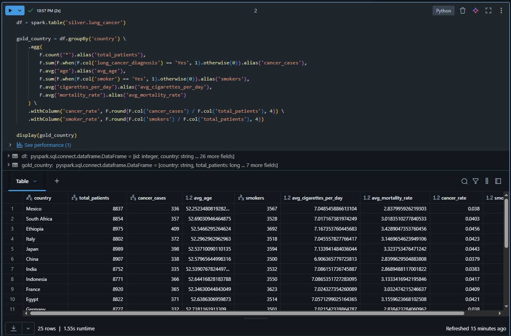
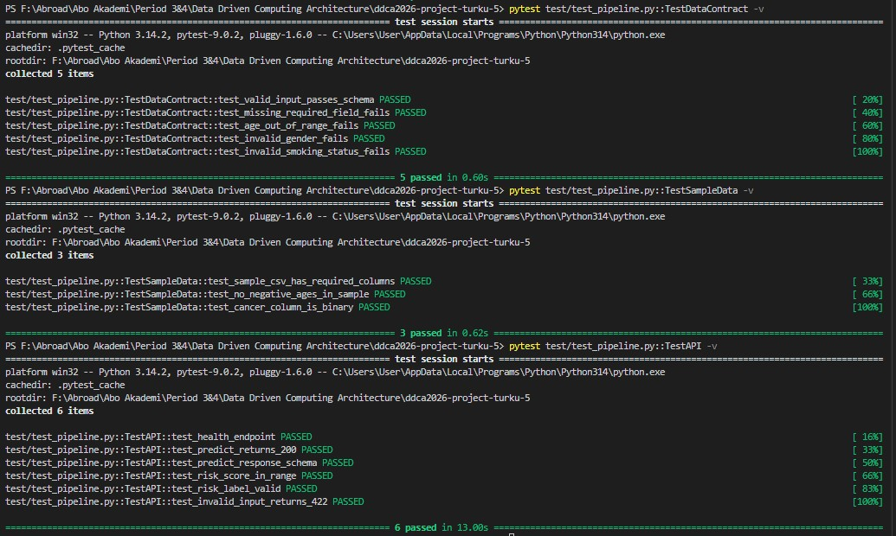

# Pipeline Examples

---

## 1. Data Lineage — Full Pipeline Flow

---

## 2. Bronze - Raw Files Uploaded to Databricks Volume

`/Volumes/workspace/bronze/raw_files/` — WHO_pollution.csv (2.15 MB), abstract-lungcancer.txt (25.25 MB), lung_cancer_dataset.csv (22.40 MB)

---

## 3. Bronze - Structured & Unstructured Ingestion Row Counts

`bronze.raw_lung_cancer`: 220,632 rows | `bronze.raw_who_pollution`: 13,176 rows | `bronze.raw_pubmed`: 487,202 rows

---

## 4. Bronze - Real-Time Air Quality Ingestion (14 Countries × 120 Records)

Total: 1,680 records fetched → saved to `bronze.raw_air_quality`

---

## 5. Bronze - Scheduled Databricks Job for Air Quality

---

## 6. Silver - Lung Cancer Data Cleaned

`silver.lung_cancer`: 220,632 → 220,632 rows (0 dropped)

---

## 7. Silver - WHO Pollution Data Cleaned

`silver.who_pollution`: 13,176 records

---

## 8. Silver - Air Quality Aggregated

`silver.air_quality`: 14 records (one per country)

---

## 9. Silver - PubMed Abstracts Structured

`silver.abstracts`: 10,000 records

---

## 10. Gold - Risk by Country Aggregated

`gold.risk_by_country`: 25 rows (one per country)

---

## 11. Gold - Optimization (ZORDER + VACUUM)

All Gold tables are optimized with `OPTIMIZE ... ZORDER BY (...)`, `VACUUM RETAIN 168 HOURS`, and `DESCRIBE HISTORY` to improve query performance and manage storage.

---

## 12. ML - Train/Test Split

Train: 176,505 | Test: 44,127 | Cancer rate: 4.1%

---

## 13. ML - XGBoost Performance (MLflow Run)

AUC: 0.6528 | Accuracy: 0.6199 | F1: 0.1270

---

## 14. Dashboard - Cancer Rate by Country

---

## 15. Dashboard - Cancer Rate vs. Air Quality (AQI)

---

## 16. Dashboard - Risk Keywords from PubMed Abstracts (Word Cloud)

---

## 17. Dashboard - Smoker Rate by Country (World Map)

---

## 18. API - Swagger UI

---

## 19. External Visualization - Google Looker Studio

---

## 20. Tests - Local pytest Run (14 tests)

---

## 21. CI - GitHub Actions (Runs on Every Push)

